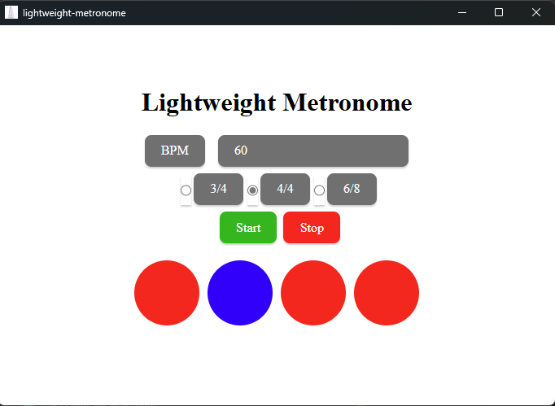

# Lightweight metronome

This is a small rust + angular application meant to provide a really lightweight metronome that is really fast to open and use.

The purpose of it is maximizing the use of metronome when practicing an instrument. It takes less than a second to open and can be managed completely just with the space bar and the arrow keys.

## Installation

### Built package

1. Follow the instructions of the installer in the latest release.

### Compile

1. You can compile it yourself by first installing `tauri` and its dependencies (requires `npm` and `rust` installed).
1. Then building it with: `npm run tauri build`.

## Usage

The usage should be self explanatory with the UI.

Shortcuts:

|Key| Action|
|----|---|
|Space| Start/stop |
|ArrowUp/ArrowDown|Increase/decrease bpm|
|ArrowLeft/ArrowRight|Change the time signature|

## Roadmap

- [ X ] Create time signature radio button.
- [ X ] Use same button to pause and start.
- [ X ] Add logo.
- [ X ] Document readme.
- [] Commit to gitlab.
- [] Create pipeline to build the artefact.
- [] Build artefact.
- [] Release first version.
